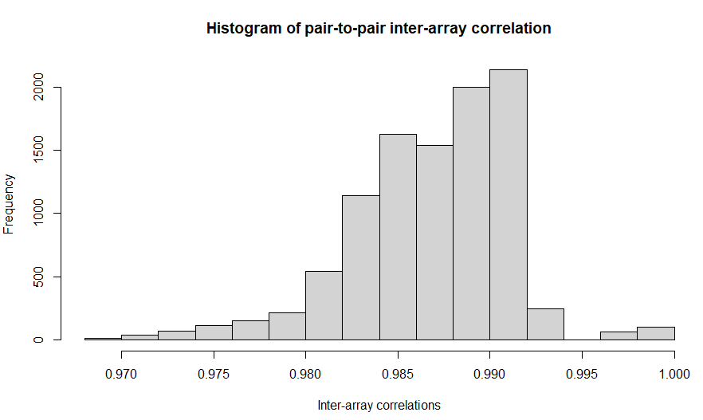
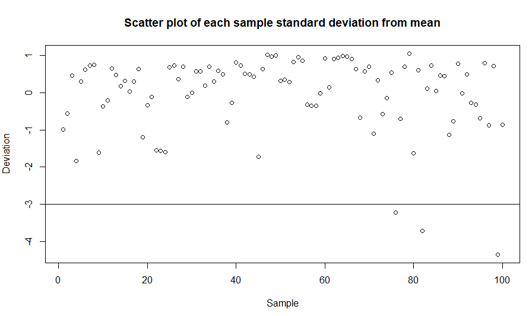
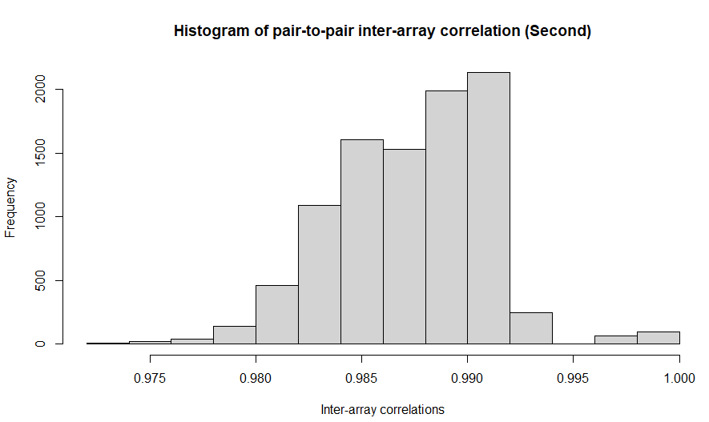
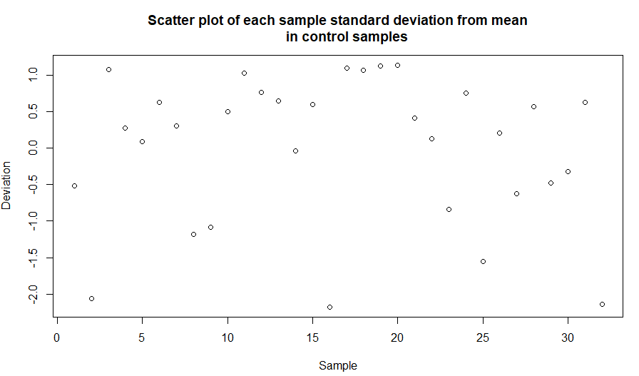
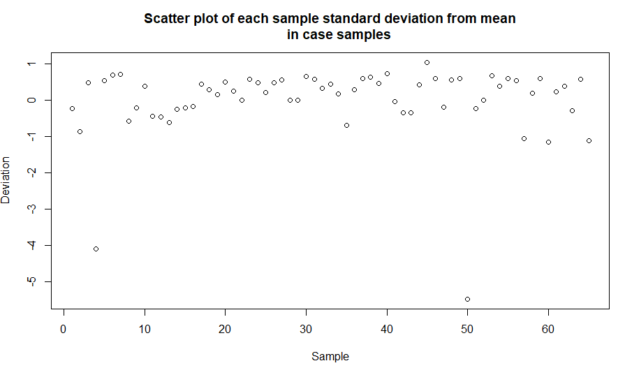
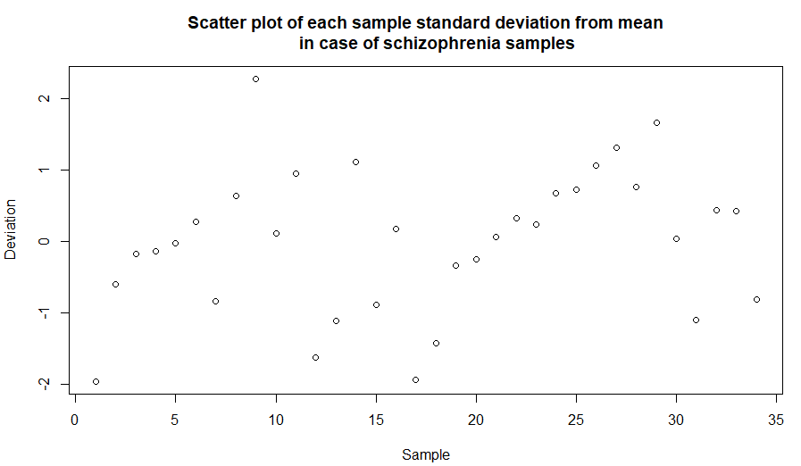

# Introduction

This work will present data analysis from a research that studied the 
enchancer's at *IGF2* differential methylation association with abnormal 
dopamine synthesis in major psychosis [@pai2019differential].

Our samples were taken from the prefrontal cortex isolated neurons from patients 
with schizophrenia and bipolar disorder.

The study analysed data from individuals diagnosed with schizophrenia, bipolar
disorder and controls (29, 26 and 27 individuals respectively).
In the analysis, study controlled for age, sex, post-mortem interval, genetic 
ancestry (determined by genotyping the same individuals).

## Experiment design

The experiment design was multi-omics study with 55 cases (with schizophrenia or
bipolar disorder) and 27 controls.

## Objective of the research

According to authors, schizophrenia and bipolar disorder have got characteristic 
of periods of psychosis. The main objective of the research was to gather 
epigenomic profiling data to get a more accurate model of neuronal 
dysregulation in diseases with periods of psychosis.

## Biological targets of the research

Researchers intended to look for specific patterns of DNA methylation in 
isolated neurons from the frontal cortex of individuals that had diseases.

- IGF2 - insulin growth factor 2 protein
- *IGF2* - IGF2 gene
- *Igf2* - enhancer of *IGF2*
- TH - tyrosine hydroxylase protein
- dopamine - a neuromodulatory molecule
- psychosis - an abnormal condition of the mind that results in difficulties 
  determining what is real and what is not real 

## Results received

Authors found a strong association between methylation of *Igf2* and TH 
synthesis. 
TH is the bottleneck enzyme that is responsible for dopamine synthesis. 
If enhancer *Igf2* is hypomethylated, levels of TH are higher, which 
determines the higher production
of dopamine. Apparently, dopamine is responsible for psychosis in the 
mental disorders of interest.

## Additional information

Schizophrenia and bipolar disorder patients are consistently hypomethylated
at *IGF2* locus when compared to controls. This locus remained significantly 
hypomethylated even after accounting lifestyle-related variables of smoking
and anti-psychotic use.

The reaction chain of interest of the research (upward arrows show elevated
expression or synthesis of the protein, product, or effect):

Hypomethylation of *Igf2* $\rightarrow$ $\uparrow$ IGF2 $\rightarrow$ 
$\uparrow$ TH $\rightarrow$ $\uparrow$ dopamine $\rightarrow$ $\uparrow$ 
psychosis

# Data preparation

```{r setup, include=FALSE}
knitr::opts_chunk$set(echo = TRUE, eval=FALSE)
```

```{r include=FALSE, eval=FALSE}
BiocManager::install("minfi")
BiocManager::install("IlluminaHumanMethylationEPICmanifest")
library(minfi)
library(IlluminaHumanMethylationEPICmanifest)
```

```{r include=FALSE, eval=FALSE}
BiocManager::install("IlluminaHumanMethylationEPICanno.ilm10b4.hg19")
library(IlluminaHumanMethylationEPICanno.ilm10b4.hg19)
```

```{r include=FALSE}
sample_keys <- read.csv('../data/GSE112179_RAW/GSE112179.csv')

# Basename
sample_keys$Basename <- paste('../data/GSE112179_RAW/', sample_keys$Basename, 
                              sep='')
(sample_keys$Basename)

# Unknown values
sample_keys$pmi[sample_keys$pmi == "unknown"] <- NA_real_
sample_keys$pmi[sample_keys$pmi == "?"] <- NA_real_
sample_keys$race[sample_keys$race == "?"] <- NA_character_

# Lower case
sample_keys$race <- tolower(sample_keys$race)
sample_keys$sex <- tolower(sample_keys$sex)
sample_keys$diagnosis <- tolower(sample_keys$diagnosis)
```

Sample keys heading is made of the following columns names:

- *id* - an identifier of the sample
- *sentrix_id* - Illumina's Sentrix BeadChip identifier 
  (13 unique values) 
  [@imatsentrix]
- *sentrix_row* - row number in the Sentrix array
- *sentrix_col* - column number in the Sentrix array
- *basename* - sample identifier in the research (joined values in a format:
  \newline [\textit{id}]_[*sentrix_id*]_R0[*sentrix_row*]C0[*sentrix_id*])
- *tissue_bank_id* - an identifying number of the tissue bank from which the 
  sample was taken
- *tissue_bank* - the literal identifier of the tissue bank
- *tissue* - a tissue type from which the sample was taken
- *cell_type* - a cell type found in the sample
- *donor* - an integer number that identifies the donor of the sample 
  (82 unique values)
- *pmi* - a post-mortem interval, unknown values 
  were labeled as NA
- *race* - race of the donor (white, black, hispanic, or unknown (NA))
- *sex* - gender of the donor
- *diagnosis* - an experimental group of the donor (bipolar, schizophrenia, or
  control)
- *age* - age of the donor (years)
  
As it was noted in the article, there were 100 records in the sample keys 
dataset.

```{r include=FALSE, eval=FALSE}
# Reading IDAT data
rgcs <- read.metharray.exp(targets=sample_keys)
```

```{r include=FALSE, eval=FALSE}
# Saving RGChannelSet object data to file 
rgcs_location <- '../data/GSE112179_RGCS.rgcs'
saveRDS(rgcs, file='../data/GSE112179_RGCS.rgcs')
```

```{r include=FALSE, eval=FALSE}
# Loading RGChannelSet object to RAM.
RGSet <- readRDS(file=rgcs_location)
```

## Calculating detection p-values

Getting detection p-value for each score of DNA modification. These p-values
determine whether the measured intensity can be distinguished from the 
background.

```{r include=FALSE, eval=FALSE}
# Getting detection p values as matrix
detP <- detectionP(RGSet)

# Converting matrix to a data frame
detP_f <- data.frame(detP)
```

All values that have got p-value higher than 0.01 are considered as bad and 
all samples that have more than 1% of bad detection p-values should be removed.

```{r include=FALSE, eval=FALSE}
# Columns determine samples, rows define location of modification

# Calculating how many values compose one percent
one_perc <- round(nrow(detP) / 100)

# Looping over columns (samples)
for(i in 1:ncol(detP_f)) {    
  higher_p <- 0
  # Looping over p values of each sample
  for(p in detP_f[ , i]){
    # p value higher than 0.01 is considered as bad
    if(p > 0.01){
      higher_p <- higher_p+1
    }
  }
  # Getting sample names for removal
  if(higher_p > one_perc){
    print(colnames(detP_f)[i]) 
  }
}
```

Although, in our data, none of the samples had more than 1% of bad values, 
therefore no 
sample was removed.

## Predicting sample sex

This stage estimates sample sex based on methylation data.

```{r include=FALSE, eval=FALSE}
GMSet <- mapToGenome(RGSet)
RGSet_est_sex <- getSex(GMSet)
```

Number of females and males after estimation matched original data (25 female 
and 75 male).

Converted 'M' and 'F' notation to 'male' and 'female'.

```{r include=FALSE, eval=FALSE}
RGSet_est_sex$predictedSex[RGSet_est_sex$predictedSex == 'M'] <- 'male'
RGSet_est_sex$predictedSex[RGSet_est_sex$predictedSex == 'F'] <- 'female'
```

```{r include=FALSE, eval=FALSE}

bad_samples <- list()

# Looping over each position
for(i in 1:length(RGSet_est_sex$predictedSex)) {    
  if(RGSet_est_sex$predictedSex[i] != RGSet$sex[i]){
    bad_samples[[length(bad_samples)+1]] <- rownames(RGSet_est_sex)[i]
  }
}

bad_sample
```

No mismatches between real and estimated sex were found.

## Data normalisation

According to the documentation of *minfi* package [@fortin485512analysis], 
*preprocessFunnnorm()* function is recommended for known large-scale differences
(for example, cancer/normal) or between-tissue studies. Our chosen data 
spans only over one cell type of one tissue, therefore it was decided to opt for
different normalisation methods.

Authors [@pai2019differential] noted
that they used noob normalisation followed by the quantile one. Quantile 
normalisation performs processing of Type I and Type II array design 
differences. Whereas, *preprocessIllumina()* normalisation has only background 
subtraction 
and control normalisation implemented. Therefore, we decided to choose 
*preprocessSWAN()* normalisation, since this method performs within-array 
normalisation correction for technical differences between Type I and Type II 
array designs.

```{r include=FALSE, eval=FALSE}
set.seed(1)
MSet.swan <- preprocessSWAN(RGSet)
```

## Filtering position data by detection p-values

```{r include=FALSE, eval=FALSE}
# Columns determine samples, rows define location of modification

# Calculating how many values compose one percent
one_perc_samples <- round(ncol(detP) / 100)

bad_positions <- list()
# Looping over each position
for(i in 1:nrow(detP_f)) {    
  higher_p <- 0
  # Looping over p values of each position
  for(p in detP_f[i, ]){
    # p value higher than 0.01 is considered as bad
    if(p > 0.01){
      higher_p <- higher_p+1
      if(higher_p > one_perc_samples){
        bad_positions[[length(bad_positions)+1]] <- rownames(detP_f)[i]
        break
      }
    }
  }
}
```

There were 5835 positions found that had p-value higher than 0.01 in 1% of the
samples. These positions were removed from the dataset. After this procedure,
we have 861001 positions in each sample.

```{r include=FALSE, eval=FALSE}
length(unique(bad_positions))
MSet.swan <- MSet.swan[!(row.names(MSet.swan) %in% bad_positions), ]
```

```{r include=FALSE, eval=FALSE}
intermed_file_loc <- '../data/GSE112179_MSet_SWAN_clean.rds'
```

```{r include=FALSE, eval=FALSE}
saveRDS(MSet.swan, file=intermed_file_loc)
```


## Removing methylation loci positions

```{r include=FALSE, eval=FALSE}
MSet.swan <- dropMethylationLoci(MSet.swan, dropRS = TRUE, dropCH = TRUE)
```

Removed 2918 methylation loci, that do not contain "CG" nucleotide 
pair (CH probes) or are close to DNR polymorphisms. After removal data contains
858083 positions in each sample.

## Making three different data objects

```{r include=FALSE, eval=FALSE}
#Each score of DNA modification matrix
beta <- getBeta(MSet.swan)

#Saving data to file
beta_matrix_file <- '../data/GSE112179_beta_matrix.rds'
saveRDS(beta, file=beta_matrix_file)

#Information about main matrix samples (columns)
pdata <- pData(MSet.swan)

#Saving data to file
pdata_file <- '../data/GSE112179_pdata.rds'
saveRDS(pdata, file=pdata_file)

#Information about main matrix positions (rows)
anot <- getAnnotation(MSet.swan)

#Saving data to file
anot_file <- '../data/GSE112179_anot.rds'
saveRDS(anot, file=anot_file)
```

Generated DNA modification score matrix, information about main matrix samples
 and information about main matrix positions and saved this data into files for
 later manipulations.
 
## Interarray correlation outliers elimination

Identification and removal of samples with divergent modification scores.

```{r include=FALSE, eval=FALSE}
#Calculating IACs for all pairs of samples
IAC_matrix = cor(beta, use="p")

#Histogram for outliers examination
hist(IAC_matrix)
```


Histogram identifies that our dataset contains values which distort the 
overall distribution.
For further investigation, standard deviation from mean in each sample was 
calculated.

```{r include=FALSE, eval=FALSE}
#Mean for each column
mean_IAC <- apply(IAC_matrix,2,mean)

#Calculating standard deviation for data
SDev <- sd(mean_IAC) 

#From each column mean substracting all data mean and dividing by standard deviation
column_sd <- (mean_IAC-mean(mean_IAC))/SDev

#Ploting each column result
plot(column_sd) 

#selecting boundary
abline(h=-3)
```


Scatter plot of each sample (column) standard deviation from mean
visually highlights data outliers (under -3 limit).

```{r include=FALSE, eval=FALSE}
limit <- -3
outliers <- dimnames(beta)[[2]][numbersd<limit]
#removing outliers
beta <- beta[,!(column_sd<limit)]
MSet.swan <- MSet.swan[,!(colnames(MSet.swan) %in% outliers)]
#Selecting IDs of outliers
```

Algorithm identified and removed 3 outliers: *"GSM3059462_200590490031_R08C01"  
"GSM3059520_200357150067_R08C01" "GSM3059454_200590490031_R01C01"*. 

```{r include=FALSE, eval=FALSE}
#Calculating IACs for all pairs of samples
IAC_matrix <- cor(beta, use="p")

#Histogram for outliers examinatiot
hist(IAC_matrix)
```


There is a visible difference on the left side of the histogram. This change 
indicated that we correctly removed distorting values.

```{r include=FALSE, eval=FALSE}
#Mean for each column
mean_IAC <- apply(IAC_matrix,2,mean)
#Calculating standard deviation for data
SDev <- sd(mean_IAC) 
#From each column mean substracting all data mean and dividing by standard deviation
column_sd <- (mean_IAC-mean(mean_IAC))/SDev
#Ploting each column result
plot(column_sd) 
#selecting boundary
abline(h=-3)
```


No outliers are left in recalculated scatter plot.

## Quality control

After all data manipulations, our set has 97 samples with 861001 positions.

```{r include=FALSE, eval=FALSE}
control_pos <- list()
case_pos <- list()

#Separating control and case id's
for(index in 1:length(colnames(MSet.swan))) {
  if(MSet.swan$diagnosis[index]== "control"){
    control_pos[[length(control_pos)+1]] <- colnames(MSet.swan)[index]
  } else {
    case_pos[[length(case_pos)+1]] <- colnames(MSet.swan)[index]
  }
}

#Saving separated case and control data 
MSet.swan_control <- MSet.swan[,(colnames(MSet.swan) %in% control_pos)]
MSet.swan_case <- MSet.swan[,(colnames(MSet.swan) %in% case_pos)]
```

Data for quality control was separated into case (65) and control (32). Our main
 goal is to check if distortions in methylation data exist.
 
```{r include=FALSE, eval=FALSE}
#Obtaining methylation estimates for case and control data separately
meth_control <- getMeth(MSet.swan_control)
meth_case <- getMeth(MSet.swan_case)
```

```{r include=FALSE, eval=FALSE}
#Calculating pair-to-pair correlation in control data
cor_control <- cor(meth_control, use = "p")
hist(cor_control)
```


Histogram represents pair-to-pair correlation in control methylation data.

```{r include=FALSE, eval=FALSE}
mean_control <- apply(cor_control,2,mean)
#Calculating standard deviation for data
SDev <- sd(mean_control) 
#From each column mean substracting all data mean and dividing by standard deviation
column_sd <- (mean_control-mean(mean_control))/SDev
#Ploting each column result
plot(column_sd) 
```


We can indicate both from histogram and scatter plot that data is distributed 
normally and there is no need for data removal.

```{r include=FALSE, eval=FALSE}
cor_case <- cor(meth_case, use = "p")
hist(cor_case)

```


Case methylation data indicates, that our data has distorted values. 

```{r include=FALSE, eval=FALSE}
mean_case <- apply(cor_case,2,mean)
#Calculating standard deviation for data
SDev <- sd(mean_case) 
#From each column mean substracting all data mean and dividing by standard deviation
column_sd <- (mean_case-mean(mean_case))/SDev
#Ploting each column result
plot(column_sd)
```


Scatter plot demonstrates two outliers in standard deviation from methylation
mean. For further analysis we separated case data into "bipolar" and 
 "schizophrenia" cases.

```{r include=FALSE, eval=FALSE}
case_bipolar <- list()
case_schi <- list()
#Separating data into "bipolar" and "schizophrenia"
for(index in 1:length(colnames(MSet.swan))) {
  if(MSet.swan$diagnosis[index]== "bipolar"){
    case_bipolar[[length(case_bipolar)+1]] <- colnames(MSet.swan)[index]
  } else if(MSet.swan$diagnosis[index]== "schizophrenia"){
    case_schi[[length(case_schi)+1]] <- colnames(MSet.swan)[index]
  }
}

#Saving separated cases
MSet.swan_bipol <- MSet.swan[,(colnames(MSet.swan) %in% case_bipolar)]
MSet.swan_schi <- MSet.swan[,(colnames(MSet.swan) %in% case_schi)]
```

```{r include=FALSE, eval=FALSE}
#Obtaining methylation estimates for both cases
meth_bipol <- getMeth(MSet.swan_bipol)
meth_schi <- getMeth(MSet.swan_schi)

#Calculating pair-to-pair correlation
cor_bipolar <- cor(meth_bipol, use = "p")
cor_schi <- cor(meth_schi, use = "p")
```

```{r include=FALSE, eval=FALSE}
mean_case <- apply(meth_bipol,2,mean)
#Calculating standard deviation for data
SDev <- sd(mean_case) 
#From each column mean substracting all data mean and dividing by standard deviation
column_sd <- (mean_case-mean(mean_case))/SDev
#Ploting each column result
plot(column_sd) 
```


Bipolar cases does not show any big fluctuations from methylation mean value.

```{r include=FALSE, eval=FALSE}
mean_case <- apply(meth_schi,2,mean)
#Calculating standard deviation for data
SDev <- sd(mean_case) 
#From each column mean substracting all data mean and dividing by standard deviation
column_sd <- (mean_case-mean(mean_case))/SDev
#Ploting each column result
plot(column_sd) 
```


Schizophrenia cases also does not show any wide variations from methylation
mean value.

This separated each case data indicated that there is no need to remove any
data.

```{r include=FALSE, eval=FALSE}

qc <- getQC(MSet.swan)
addQC(MSet.swan, qc)
plotQC(qc)
```

Estimated sample-specific quality control for methylation data with getQC, 
addQC and plotQC functions.


PlotQC demonstrates, that bad samples does not exist in our data set.

## Saving data

```{r include=FALSE, eval=FALSE}
saveRDS(MSet.swan, file='GSE112179_clear.rds')
```

Saved data after all manipulations into *GSE112179_clear.rds* file.

# References {-}

